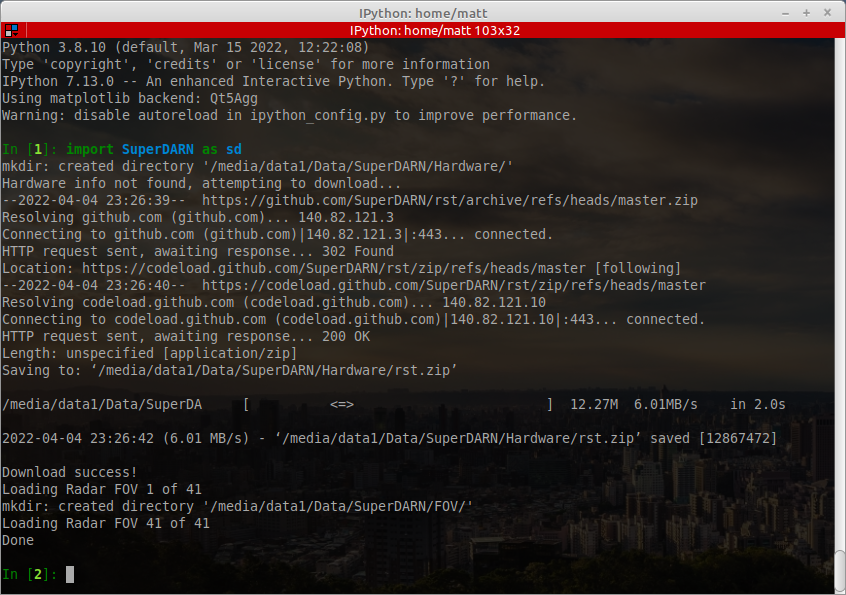
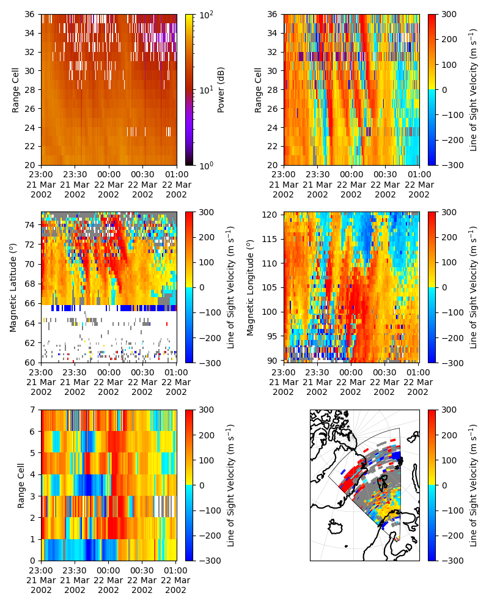
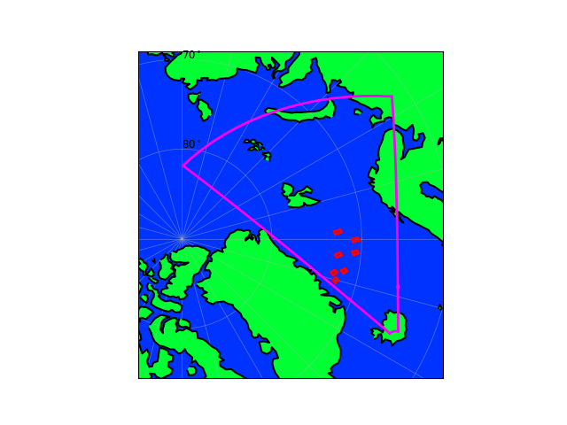

# SuperDARN

Some simple tools for reading and plotting SuperDARN data. Code here is based on some old code I wrote after transitioning from IDL to Python, there may be mistakes so use with caution!

## Installation

In a terminal:

```bash
#clone this repo
git clone https://github.com/mattkjames7/SuperDARN
cd SuperDARN

#build a Python package
python3 setup.py bdist_wheel

#install it (replace 0.1.0 with whatever version is built)
pip3 install dist/SuperDARN-0.1.0-py3-none-any.whl --user
```

In `~/.bashrc` add the following environment variables:

```bash
#path to where FITACF files are stored
export FITACF_PATH=/some/path/to/fitacf

#path to where this module can create some files
export SUPERDARN_PATH=/some/other/path/SuperDARN
```

NOTE: This code works with 2-hourly fitacf files which have filenames/paths in the format:

`$FITACF_PATH/stn/yyyy/yyyymmhh.hhmm.00.stn.fitacf.bz2`

where `stn` is the three letter radar code (lower case) subdirectory, `yyyy` is a subdirectory for the year, `yyyymmdd` is the date and `hhmm` is the time, e.g.:

`$FITACF_PATH/han/2002/20020321.2001.00.han.fitacf.bz2`

Other file/folder naming formats might not work, but could be accommodated if you raise an issue here.

This module relies on some C++ code I wrote to read some of the basic data from the fitacf files. This will require an installation of GCC (`g++` specifically) and `make`. If the shared object file fails to load when this module is imported, the code will attempt to recompile itself using `make` and `g++`. If this fails, copy the traceback into an issue and I will attempt to resolve it.

## Usage

On its first successful import the module will attempt to download some useful tables for the radar (from here: [GitHub - SuperDARN/rst: Radar Software Toolkit (RST)](https://github.com/SuperDARN/rst) - I claim no credit for these). These tables are essential for working out where each field of view (FOV) is.

It will also save some files which contain the coordinates of each radar's field of view. The output should look someting like this:



### Reading Data

There are a few functions within `SuperDARN.Data` which provide the data in slightly different forms, e.g.:

```python
import SuperDARN as sd

#get the data from a single cell (Radar,Date,ut,Beam,Gate)
cdata = sd.Data.GetCellData('han',20020321,[22.0,24.0],9,25)

#or a whole beam of data (Radar,Date,ut,Beam)
bdata = sd.Data.GetBeamData('han',[20020321,20020322],[22.0,24.0],7)

#data for the whole field of view (Radar,Date,ut)
#in this case, the output is a dict where each key is a beam number
#pointing to a recarray for each beam as produced by GetBeamData
rdata = sd.Data.GetRadarData('han',[20020321,20020322],[22.0,23.0])
```

In the above examples `bdata` and `cdata` are `numpy.recarray` objects, `rdata` is a `dict` object containing a `numpy.recarray` for each beam.

The fitacf data are stored in memory once loaded so that they don't need to be re-read every time the data are requested. To check how much memory is in use and to clear it:

```python
#check memory usage
sd.Data.MemUsage()

#clear memory
sd.Data.ClearData()
```

### Plotting Data

There are a bunch of very simple plotting functions, e.g.:

```python
import matplotlib.pyplot as plt

#create a figure
plt.figure(figsize=(8,11))

#plot the power along a beam
ax0 = sd.Plot.RTIBeam('han',[20020321,20020322],[23.0,1.0],9,[20,35],
                        Param='P_l',ShowScatter=True,fig=plt,
                        maps=[2,3,0,0],scale=[1.0,100.0],zlog=True,
                        cmap='gnuplot')

#the velocity
ax1 = sd.Plot.RTIBeam('han',[20020321,20020322],[23.0,1.0],9,[20,35],Param='V',
                        fig=plt,maps=[2,3,1,0])

#velocity along a range of latitudes at a ~constant longitude of 105
ax2 = sd.Plot.RTILat('han',[20020321,20020322],[23.0,1.0],105.0,Param='V',
                        fig=plt,maps=[2,3,0,1])

#velocity along a range of longitudes at a ~constant latitude of ~70
ax3 = sd.Plot.RTILon('han',[20020321,20020322],[23.0,1.0],70.0,Param='V',
                        fig=plt,maps=[2,3,1,1])

#some random cells
beams = [1,5,7,2,8,4,9]
gates = [20,26,33,22,25,21,29]
ax4 = sd.Plot.RTI('han',[20020321,20020322],[23.0,1.0],beams,gates,
                    Param='V',fig=plt,maps=[2,3,0,2])

#totally different FOV plot
ax5 = sd.Plot.FOVData('han',20020321,23.5,Param='V',fig=plt,maps=[2,3,1,2])


plt.tight_layout()
```

which should produce:



### Fields of View

These are probably wrong. Use with great caution.

The fields of view of each radar are stored as instances of the `SuperDARN.FOV.FOVObj` objects in memory and can be accessed using `GetFOV`, e.g.:

```python
#get the object from memory
fov = sd.FOV.GetFOV('pyk',Date)

#use it to retrieve the FOV in mag coordinates
mlon,mlat = fov.GetFOV(Mag=True,Date=Date)

#plot it
ax = fov.PlotPolar(Background=[0.0,0.2,1.0],Continents=[0.0,1.0,0.2],
                color='magenta',ShowBeams=False,ShowCells=False,
                linewidth=2.0,Mag=True,Lon=True)

#add some cells
beams = [1,5,7,2,8,4,9]
gates = [20,26,33,22,25,21,29]
fov.PlotPolarCells(beams,gates,color='red',fig=ax,Mag=True,linewidth=2.0,Lon=True)
```

The above code should look like this:


